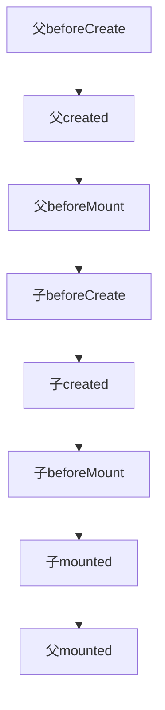
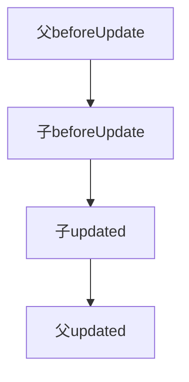
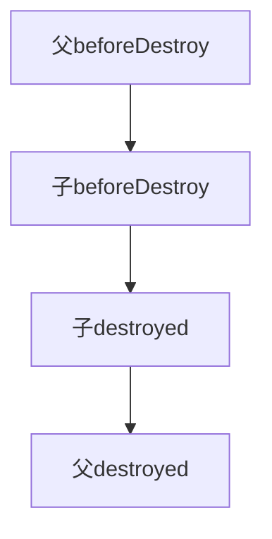

## 简述 MVVM 框架

Model:代表数据模型，也可以在 Model 中定义数据修改和操作的业务逻辑。

View: 代表 UI 组件，它负责将数据模型转化成 UI 展现出来。

ViewModel: 监听数据模型的改变和控制视图行为、处理用户交互，简单理解就是一个同步 View 和 Model 的对象，连接 Model 和 View。

## vue2 和 vue3 区别

1. 写法上的区别:vue2 使用的是`options(选项)Api`,vue3 的是`composition Api`(当然 vue3 也兼容`composition api`)。`options Api`中`methods，compute，data`等 api 都是分散的。而`composition api`中的代码是根据逻辑功能来组织的,我们可以将一个功能所定义的`methods，compute，data`等 api 会放在一起,让我们可以更灵活地组合组件逻辑。
2. vue2 将响应式数据放到 data 函数中,而 vue3 则是使用`ref`和`reactive`将数据声明为响应式
3. 响应式实现方式:vue2 中是通过`Object.defineProperty`对数据劫持实现的,vue3 中则是使用`Proxy`对数据代理实现的。
4. 生命周期区别:vue3 中将`beforeCreate`和`created`合并到了`setup`函数中
5. 根节点: vue3 组件允许多个根节点,而 vue2 只允许一个
6. 内置组件: vue3 新增了传送组件`Teleport`和异步依赖处理组件`Suspense`

## v-if 和 v-show

1. `v-if`表示一个 dom 元素是否被创建，而`v-show`则是控制这个 dom 元素的`display`属性是否为`none`
2. 一般在频繁切换状态的地方使用`v-show`,`v-if`则更适合条件不经常改变的场景，因为它切换开销相对较大

## v-for 和 v-if 优先级

1. 开发过程中一般不建议同时将 v-for 和 v-if 放在一个标签中使用
2. Vue2 中 v-for 的优先级会更高，所以会先执行循环，再进行 v-if 判断，所以这样就会导致无论需不需展示这个元素，都会先遍历整个列表
3. 在 Vue3 中 v-if 的优先级会更高，但是当我们遍历一个数组的时候，根据数组中的某个元素进行 v-if 判断的时候就会报错，因为 v-if 会先执行此时还没有拿到这个数组。所以 Vue3 中会报错

## 介绍 Vue 插槽用法

插槽`slot`可以理解为占坑，当使用一个组件的时候，在组件标签里的对应的内容就会替换掉这个组件中的`slot`标签。

插槽分为`默认插槽`，`具名插槽`，`作用域插槽`。

**默认插槽**
子组件中用`slot`标签来确定渲染位置，父组件使用它时直接在子组件的标签内写入内容即可

```
//子组件
<template>
    <slot />
</template>

//父组件
<Child>
  <div>默认插槽</div>
</Child>
```

**具名插槽**

顾名思义就是具有名字的插槽，子组件中可以用`name`熟悉对`slot`命名，父组件在使用的时候通过
`template`中的`v-slot:name`或者`#name`来定义这个插槽中的内容

```
//子组件
<template>
  <slot name="content"></slot>
</template>

//父组件
<Child>
    <template v-slot:content>具名插槽内容</template>
</Child>
```

**作用域插槽**

子组件中的`slot`可以通过类似组件属性传递的方式将子组件的值传递给父组件中这个子组件的`插槽内容中`（子组件标签内），在父组件使用子组件的时候要用`v-slot`的值进行接收这些参数，默认插槽可以将其直接写在子组件标签上，具名插槽则写在`template`上。而传过来的值只能在子组件标签中或者`template`标签中使用。所以在父组件作用域中获取到了子组件作用域中的变量，可以认为作用域插槽延伸了子组件数据的作用范围，因此叫做作用域插槽

## 过滤器的作用，如何实现一个过滤器

过滤器是用来过滤数据的，在 Vue 中使用 filters 来过滤数据，filters 不会修改数据，而是过滤数据，改变用户看到的输出

**使用场景**：

- 需要格式化数据的情况，比如需要处理时间、价格等数据格式的输出 / 显示。
- 比如后端返回一个 年月日的日期字符串，前端需要展示为 多少天前 的数据格式，此时就可以用 fliters 过滤器来处理数据。

过滤器是一个函数，它会把表达式中的值始终当作函数的第一个参数。过滤器用在插值表达式 {{ }} 和 v-bind 表达式 中，然后放在操作符“ | ”后面进行指示

```vue
<li>商品价格：{{item.price | filterPrice}}</li>

filters: { filterPrice (price) { return price ? ('￥' + price) : '--' } }
```

**注意** vue3 已经移除了过滤器

## 常见的事件修饰符及其作用

- .stop：等同于 JavaScript 中的 event.stopPropagation() ，防止事件冒泡；
- .prevent ：等同于 JavaScript 中的 event.preventDefault() ，防止执行预设的行为（如果事件可取消，则取消该事件，而不停止事件的进一步传播）；
- .capture ：将事件改成捕获模式,由外到内触发
- .self ：只会触发自己范围内的事件，不包含子元素；
- .once ：只会触发一次。

## v-model 如何实现的

v-model 其实是一个语法糖,比如

```
<input v-model="message" />
 等同于
<input
   :value="message"
   @input="message=$event.target.value"
>
```

## Vue2 中给 data 中的对象属性添加一个新的属性时会发生什么？如何解决？

Vue2 中对象添加新属性绑定的视图不会更新,因为 Vue2 中 Object.defineProperty 劫持不到 data 对象中新增的属性,可以使用`this.$set(this.obj, 'b', 'obj.b')`解决

> $set()方法相当于手动的去把 obj.b 处理成一个响应式的属性，此时视图也会跟着改变了。

## Vue 插件用法

面试一般会问你如何写一个 vue 插件,所以没写过 vue 插件的最好去亲自体验一下

**回答:**

`vue`实例会有一个`use`函数,它接受的是一个带有`install`函数的对象和一个可选的选项对象,当我们使用 `vue.use(plugin)`或者`app.use(plugin)`会调用我们插件的`install`属性的函数,并且将当前组件的实例传进来.所以在插件中就可以对这个实例进行一些操作来实现我们插件的功能

## Vue 自定义指令

vue  官方提供了 v-text、v-for、v-model、v-if  等常用的指令。除此之外 vue  还允许开发者自定义指令。**面试经常会问什么是自定义指令?你用自定义指令做过哪些功能?**

**回答 1:什么是自定义指令?**

1. 自定义指令包含局部指令和全局指令,在模板中使用指令前必须先使用`directives`选项注册。局部指令指在某个组件中注册,而全局则是将指令注册到全局,通常在 main.js 中注册。
2. 自定义指令由一个包含类似组件生命周期钩子的对象来定义。它的生命周期钩子包含`created`,`beforeMount`,`mounted`,`beforeUpdate`,`updated`,`beforeUnmount`,`unmounted`,
3. 常用的钩子为`mounted`  和  `updated`,它接受`el`,`binding`等参数.`binding`参数的值一般包含绑定到这个元素上的信息,比如下面这个指令

```js
<div v-example:foo.bar="baz">
```

它的 binding 会是这个对象

```
 {
    arg: 'foo',
    modifiers: { bar: true },
    value: /* `baz` 的值 */,
    oldValue: /* 上一次更新时 `baz` 的值 */
 }
```

---

**回答 2:你用自定义指令做过哪些功能?**

1. 数据埋点,通过绑定自定义事件传入点击当前元素需要埋点的事件名,在指令中监听当前元素的点击事件后调用后台接口将事件名传入
2. 权限控制,通过绑定自定义事件传入控制当前元素的权限字段,在指令中获取到当前元素根据权限字段来控制该元素的状态(显示,隐藏等)

## computed 和 watch

1. **computed**是计算属性,依赖其它属性值,用于解决模板中放入过多的逻辑会让模板过重且难以维护的问题.**watch**是侦听器,当我们需要根据一个属性的变化而做出一些处理的时候,可以使用**watch**来对这个属性进行监听
2. **computed**具有缓存的特点,即当它所依赖的属性发生改变的时候它才会重新执行内部逻辑.如下代码

```js
<template>
    <div>{{ addSum }}</div>
    <div>{{ addSum }}</div>
    <div>{{ addSum }}</div>
</template>
<script setup>
import { computed, ref, watch } from "vue";
const a = ref(1)
const b = ref(2)
let addSum = computed(() => {
    console.log('内部逻辑执行')
    return a.value + b.value
})
</script>
```

页面多次使用`addSum`,但是只会打印一次"内部逻辑执行"

3. **watch**在页面首次加载的时候默认不会执行,需要设置`immediate:true`首次才会执行监听
4. **watch**默认只监听一层数据,不监听多层数据里属性的变化,需要设置`deep:true`才会进行深度监听

## vue 生命周期

| Vue2(选项式 API) | Vue3(setup)     | 描述               |
| ---------------- | --------------- | ------------------ |
| beforeCreate     | -               | 实例创建前         |
| created          | -               | 实例创建后         |
| beforeMount      | onBeforeMount   | DOM 挂载前调用     |
| mounted          | onMounted       | DOM 挂载完成调用   |
| beforeUpdate     | onBeforeUpdate  | 数据更新之前被调用 |
| updated          | onUpdated       | 数据更新之后被调用 |
| beforeDestroy    | onBeforeUnmount | 组件销毁前调用     |
| destroyed        | onUnmounted     | 组件销毁完成调用   |

## vue 父子组件生命周期执行顺序

这个相对于上一个问题稍微复杂一点,可以试着理解记忆或者直接记住吧

**渲染过程**



**更新过程**



**销毁过程**



**注意**
如果子组件是异步组件的话它们的执行顺序会发生改变，会先执行完父组件的生命周期然后再执行子组件的生命周期

## vue 导航(路由守卫)

路由守卫分为**全局路由守卫**，**路由独享守卫**，**组件路由守卫**

- 全局路由守卫

1. `beforeEach`,接收`to、from、next`三个参数，每个路由跳转前都会触发，登录验证时用的比较多
2. `beforeResolve`，和`beforeEach`类似，区别是在导航被确认之前，同时在所有组件内守卫和异步路由组件被解析之后调用
3. afterEach，在路由跳转完成后调用，接收 to、from 两个参数

- 路由独享守卫

`beforeEnter`,一般配置在路由配置文件中（router/index.js），对进入某个路由之前进行相关操作

- 组件路由守卫

> 接收`to、from、next`三个参数

1. `beforeRouteEnter`,进入该组件之前调用，无法获取到 vue 实例

2. `beforeRouteUpdate`，在当前路由改变，但是该组件被复用时调用
3. `beforeRouteLeave`, 在离开当前组件时调用

## Vue-Router 的懒加载如何实现

使用箭头函数+import 动态加载

```js
const router = new VueRouter({
  routes: [{ path: "/list", component: () => import("@/components/list.vue") }],
});
```

## 路由的 hash 和 history 模式的区别

Vue-Router 有两种模式：hash 模式和 history 模式。默认的路由模式是 hash 模式。

1. hash 模式

简介： hash 模式是开发中默认的模式，它的 URL 带着一个#，例如：www.abc.com/#/vue，它的hash值就是#/vue。

特点：hash 值会出现在 URL 里面，但是不会出现在 HTTP 请求中，对后端完全没有影响。所以改变 hash 值，不会重新加载页面。这种模式的浏览器支持度很好，低版本的 IE 浏览器也支持这种模式。hash 路由被称为是前端路由，已经成为 SPA（单页面应用）的标配。

原理： hash 模式的主要原理就是 onhashchange()事件：

```js
window.onhashchange = function (event) {
  console.log(event.oldURL, event.newURL);
  let hash = location.hash.slice(1);
};
```

2. history 模式

简介： history 模式的 URL 中没有#，它使用的是传统的路由分发模式，即用户在输入一个 URL 时，服务器会接收这个请求，并解析这个 URL，然后做出相应的逻辑处理。
特点： 当使用 history 模式时，URL 就像这样：abc.com/user/id。相比 hash 模式更加好看。但是，history 模式需要后台配置支持。如果后台没有正确配置，访问时会返回 404。
API： history api 可以分为两大部分，切换历史状态和修改历史状态：

修改历史状态：包括了 HTML5 History Interface 中新增的 pushState() 和 replaceState() 方法，这两个方法应用于浏览器的历史记录栈，提供了对历史记录进行修改的功能。只是当他们进行修改时，虽然修改了 url，但浏览器不会立即向后端发送请求。如果要做到改变 url 但又不刷新页面的效果，就需要前端用上这两个 API。

切换历史状态： 包括 forward()、back()、go()三个方法，对应浏览器的前进，后退，跳转操作。

虽然 history 模式丢弃了丑陋的#。但是，它也有自己的缺点，就是在刷新页面的时候，如果没有相应的路由或资源，就会刷出 404 来。

如果想要切换到 history 模式，需要后端进行一些配置：如果 URL 匹配不到任何静态资源，则应该返回同一个  index.html  页面，这个页面就是你 app 依赖的根页面

Apache

```
<IfModule mod_rewrite.c>
  RewriteEngine On
  RewriteBase /
  RewriteRule ^index\.html$ - [L]
  RewriteCond %{REQUEST_FILENAME} !-f
  RewriteCond %{REQUEST_FILENAME} !-d
  RewriteRule . /index.html [L]
</IfModule>
```

nginx

```
location / {
  try_files $uri $uri/ /index.html;
}
```

## nexttick 原理

关于 nextTick 会问到它的用法,然后是它的原理,然后还可能问到 JS 的时间循环机制。

**问题 1:vue 中的 nextTick 是干什么用的?**

这个其实比较简单,用过都知道它是干嘛的,vue 官方的解释是:

> 在下次 DOM 更新循环结束之后执行延迟回调。在修改数据之后立即使用这个方法，获取更新后的 DOM。

这是什么意思呢,其实 vue 中修改 data 不会立刻触发 dom 更新;而是把需要更新的 Watcher 加入到 queueWatcher 队列中,然后在合适的时机在 nextTick 中调用这些 Watcher 的更新函数进行 dom 更新,所以在 data 刚被修改的时候,我们是获取不到更新后的 dom 的,这时候便需要调用 nextTick 函数在它的回调函数中获取到变化后的 dom

**问题 2:nextTick 原理**

1. nextTick 原理是借助浏览器事件循环来完成的,因为每次事件循环之间都有一次视图渲染,nextTick 尽量在视图渲染之前完成 dom 更新,所以 nextTick 优先使用的是 promise(微任务)实现
2. 每次执行 nextTick 时会将传入的回调函数放入一个队列中(callbacks 数组),然后当在本次事件循环的同步代码执行完毕后开启一个微任务(promise 或者 MutationObserver)去依次执行这个 callbacks 中的回调函数。
3. 但是当浏览器不支持 promise 的时候在 vue2 中会进行进行降级处理,依次使用`setImmediate`、`setTimeout`开启一个宏任务执行 callbacks
4. 当一个 data 数据更新时对应的 watcher 便会调用一次 nextTick,将它对应的 dom 更新操作作为回调函数放入 callbacks 中,所以当我们想获取这个 data 更新后的 dom 需要在其值变化后也调用 nextTick 将回调函数传入排在上个更新 dom 的回调函数后面,所以我们可以在这个 nextTick 的回调函数中获取到更新后的 data

## Vue 组件传参

这里我大概归纳了一下 vue2 和 vue3 的传参方式
| 方式 | Vue2 | Vue3 |
| --- | --- | --- |
| 父传子 | props | props |
| 子传父 | $emit | emits |
| 父传子 | $attrs | attrs |
| 子传父 | $listeners | 无(合并到 attrs 方式) |
| 父传子 | provide/inject | provide/inject |
| 子组件访问父组件 | $parent | 无 |
| 父组件访问子组件 | $children | 无 |
| 父组件访问子组件 | $ref | expose&ref |
| 兄弟组件传值 | EventBus | mitt |

## Vuex

1. Vuex 是 Vue 中的全局状态管理框架，它可以管理应用的所有组件的状态。并不是每个项目都需要引入 Vuex 的，当我们的项目有很多个页面，并且这些页面共享着多个数据状态，此时我们可以引入 Vuex。
2. Vuex 有三个核心的概念，`state`,`mutations`,`actions`,其中`state`为存放数据的地方，`mutations`中的函数作用则是用来修改`state`，`actions`中一般是用了处理一些异步操作的函数。
3. Vuex 除了上面三个概念还有`getters`,`moudles`，`getters`就像 Vue 中的计算属性`computed`一样用来描述依赖响应式状态 state 中的复杂逻辑。`moudles`则是可以将 store 分割成**模块（module）**，每个模块都拥有自己的`state`,`mutations`,`actions`等，在大型应用中经常用到
4. 场景：当我们异步获取结果并赋值给 state 的时候，比如数据请求，我们可以在`actions`中进行数据请求，拿到结果通过它的`dispatch`方法调用`mutations`中修改`state`的函数，从而将结果赋值给了`state`

## Pinia

`pinia`其实就是 Vuex5，它和 Vuex 的主要区别有以下几点

1. Pinia 使用更简单，更符合开发者的开发习惯
2. `pinia`中没有了`mutations`,状态`state`的修改可以直接进行修改，或者在`actions`中修改，或者使用它的`$patch`方法进行修改
3. `pinia`中没有了`modules`,如果想使用多个 store，直接使用`defineStore`定义多个 store 传入不同的 id 即可
4. 更好的 TS 支持，不需要创建自定义的复杂包装器来支持 TS

## vue2 混入-Mixin

vue3 中已经没有`Mixin`这个概念了，所以未来被问到的几率会越来越小，但是目前被问到的频率还是很高的。一般会它的概念以及优缺点，有时还会问它与父组件的生命周期执行顺序

vue 官网描述：

> 混入 (mixin) 提供了一种非常灵活的方式，来分发 Vue 组件中的可复用功能。一个混入对象可以包含任意组件选项。当组件使用混入对象时，所有混入对象的选项将被“混合”进入该组件本身的选项。

**回答** 1.`Mixin`的作用将组件的公共逻辑提取出来，哪个组件需要用到时，直接将提取的这部分混入到组件内部即可 2. `Mixin`的生命周期会在父组件生命周期之前执行，如果`Mixin`中的属性或者方法与父组件冲突则会使用父组件中的 2. 优点：可以降低代码冗余提高逻辑复用性。 3. 缺点：命名容易冲突，不好追溯源，后期排查不方便

## 对虚拟 dom 的理解

简单来说就是一个描述 dom 结构的 js 对象

1. 每当我们用原生 JS 或者 JQ 操作`DOM`时，浏览器会从头开始进行`DOM`树的构建，频繁的操作`DOM`开销是很大的。
2. 而虚拟`DOM`就是为了减少这些操作的，虚拟`DOM`首先会通过状态生成一个虚拟节点树（js 对象），然后使用虚拟节点树进行渲染。当某些状态发生变更时会生成新的虚拟 DOM 节点树，然后与上一次虚拟 DOM 节点树进行比较（diff），从而找到差异的部分，最后渲染到真实的 DOM 节点上面

## keep-alive

官网描述

> `<KeepAlive>`  是一个内置组件，它的功能是在多个组件间动态切换时缓存被移除的组件实例。

**回答**

1. 通常我们切换组件的时候，上一个组件就会被销毁，而当我们使用`<KeepAlive>`将其包裹的话这个组件就会被缓存，当这个组件再一次被显示时就会保留之前的状态。
2. `keep-alive`接收两个属性`include`  和  `exclude`，分别代表哪些组件要用缓存和哪些不需要缓存，它接收组件的名字数组，字符串或者正则，当我们使用动态组件`component`或者路由`router-view`的时候可以使用
3. `keep-alive`还接收`max`属性表示最大缓存实例数，如果超出这个数则最久没有被访问的缓存实例将被销毁。
4. `keep-alive`有两个生命周期，分别是`activated`和`deactivated`，`activated`钩子会在首次挂载或者每次从缓存中被重新插入的时候调用。`deactivated`钩子则是在组件从 DOM 上移除或者组件卸载时调用

## vue3 新增的内置组件

- `Teleport`组件

可以称之为传送门，作用将其插槽内容渲染到 DOM 中的另一个位置，接收两个参数 to（要去的位置）和 disabled（是否留在原位置）。接收比如下面代码

```js
<teleport to="#popup">
    <video src="./my-movie.mp4">
</teleport>
```

video 将会被传送到 id 为 popup 的元素下。

- `Suspense`组件

1.  `<Suspense>`  组件用于协调对组件树中嵌套的异步依赖的处理。
2.  它一般用于包裹多个异步组件处理多个异步组件加载前与完成后的统一状态
3.  `<Suspense>`  组件有两个插槽：`#default`  和  `#fallback`,在初始渲染时，`<Suspense>`  将在内存中渲染其默认的插槽内容。如果在这个过程中遇到任何异步依赖，则会进入**挂起**状态等待异步组件加载完毕。在挂起状态期间，展示的是  `#fallback`插槽内容

## 对 SSR 的理解

SSR 也就是服务端渲染，也就是将 Vue 在客户端把标签渲染成 HTML 的工作放在服务端完成，然后再把 html 直接返回给客户端

SSR 的优势：

- 更好的 SEO
- 首屏加载速度更快

SSR 的缺点：

开发条件会受到限制，服务器端渲染只支持 beforeCreate 和 created 两个钩子；
当需要一些外部扩展库时需要特殊处理，服务端渲染应用程序也需要处于 Node.js 的运行环境；
更多的服务端负载。

## vue 响应式原理

1. vue 的响应式原理是根据`Object.defineProperty`这个 api 来对数据进行劫持并结合发布者-订阅者模式实现的

2. 首先会利用`Object.defineProperty`中的`get`函数来对 vue 中的 data 的所有属性进行访问劫持,中间会涉及到劫持 data 中更深层次的属性需要递归调用劫持方法。这里是通过一个`Observer`类实现的
3. 劫持到每一个属性后会给这个属性绑定多个订阅者`watcher`,因为一个属性可能被用在很多地方;而这个`watcher`中则包含更新视图的函数`update`。
4. `watcher`和属性的对应关系以及和视图的联系则是通过编译模板`Compile`类来实现的。`Compile`中会拿到整个 dom 对象,然后遍历元素子节点获取到使用过 vue 中 data 属性的则给该属性直接添加一个`watcher`并赋予一些更新当前视图的方法.
5. 每个属性的多个订阅者`watcher`都会被添加到对应的数组中,这里则是通过`Deps`类实现的,初始化`watcher`的时候会调用`Deps`中的`addSub`方法将对应`watcher`添加该类的`Subs`数组中
6. 当 data 中的某个属性发生改变时则会触发`Object.defineProperty`中的`set`函数,这时便会调用该属性的`Deps`类中的`notify`函数遍历`Subs`数组中的订阅者`watcher`并调用其函数`update`去触发视图的更新

## Object.defineProperty 和 proxy 区别

1. `Object.defineProperty` 只能代理属性，`Proxy` 代理的是对象。
2. 对象上新增属性，`Proxy`可以监听到，`Object.defineProperty`不能。
3. `Object.defineProperty` 的代理行为是在破坏原对象的基础上实现的，Proxy 则不会破坏原对象，只是在原对象上覆盖了一层。
4. 数组新增修改，`Proxy`可以监听到，`Object.defineProperty`不能。
5. `Proxy`不兼容`IE11`及以下
